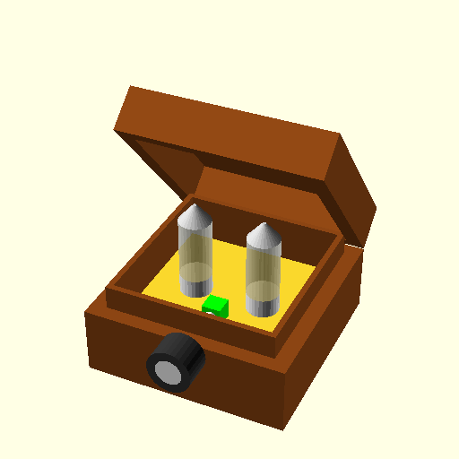

# vacuumpreamp
housing a cheap china preamp

# Introduction
Have a nice wooden box that is looking for some use as a housing
The pre-amp is a cheap vaccum tube type sourced from aliexpress
https://a.aliexpress.com/_B0MVMZ

# Dockerizing
## Pack Openscad into a docker
```
docker build -t donnels/openscad:1.0 .
```
## Run the docker to make a testfile
```
docker run --rm --name "openscad" --volume $PWD:/data donnels/openscad:1.0 openscad -o /data/test.png /data/*scad
```

